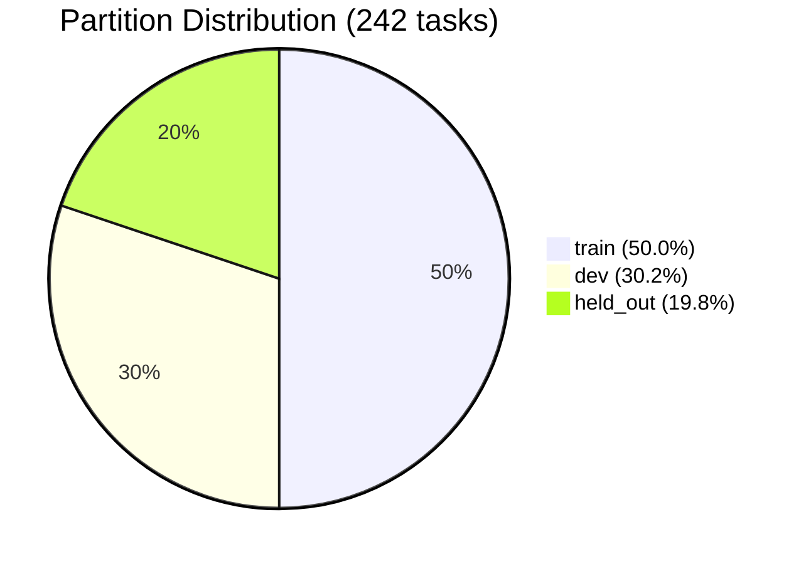
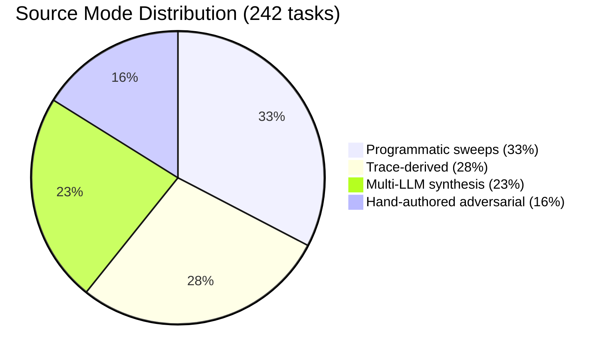
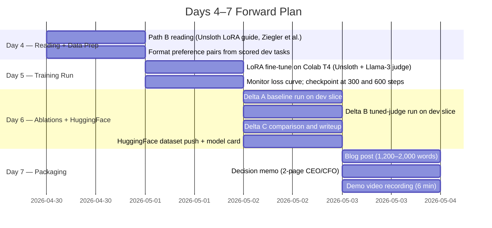

# Tenacious-Bench v0.1 — Interim Report

**Trainee:** Yonas Mekonnen  
**Challenge:** TRP1 Week 11 — Sales Agent Evaluation Bench  
**Submission type:** Interim (Acts I–II)  
**Report date:** 2026-04-29  

---

## 1. Bench Composition

### 1.1 Headline numbers

| | |
|---|---|
| Total tasks | **242** |
| Failure dimensions | **14** |
| Source modes | **4** |
| Partitions | **train / dev / held\_out** |
| Contamination | **PASS — 0 violations** |
| Difficulty spread | easy 47 · medium 89 · hard 106 |

### 1.2 Partition split



Target was 50/30/20. Actual is 50.0/30.2/19.8 — within ±1pp on every partition.

### 1.3 Source mode split



Target mix from the brief was ≈30/30/25/15. Actual is 33/28/23/16 — within ±5pp on every mode. The shift from trace-derived (30→28) toward programmatic (30→33) reflects that the probe corpus generated more combinatorial coverage than estimated. The synthesis share (25→23) is slightly under because two batches were dropped by the judge filter.

### 1.4 Failure dimension breakdown

| Dimension | Tasks | Share | Source probes |
|---|---|---|---|
| weak-evidence-overclaim | 39 | 16.1% | P007, P008, P009, P011 |
| tone-drift | 30 | 12.4% | P015, P016, P017, P035 |
| bench-over-commitment | 26 | 10.7% | P012, P013, P014 |
| competitor-gap-assertion | 26 | 10.7% | P032, P034 |
| timezone-fabrication | 25 | 10.3% | P026, P027 |
| icp-misclassification | 19 | 7.9% | P001, P005, P006 |
| dual-control-coordination | 16 | 6.6% | P023, P024, P025 |
| segment-2-first-touch | 12 | 5.0% | P010 |
| pricing-objection | 12 | 5.0% | — |
| signal-overclaim | 10 | 4.1% | P020, P036 |
| hype-vocabulary | 10 | 4.1% | — |
| directness-subject-line | 8 | 3.3% | — |
| bench-jargon | 6 | 2.5% | P015 |
| single-clear-ask | 3 | 1.2% | — |
| **Total** | **242** | **100%** | |

Dimension weighting follows the Week 10 probe trigger rates. The four P0/P1 failure families (weak-evidence-overclaim, bench-over-commitment, timezone-fabrication, competitor-gap-assertion) together account for **47.8%** of the benchmark, consistent with their dominance in the audit.

### 1.5 Source mode × partition cross-tab

```mermaid
xychart-beta
    title "Tasks per source mode per partition"
    x-axis ["programmatic", "trace-derived", "multi-llm-synthesis", "hand-authored-adversarial"]
    y-axis "Tasks" 0 --> 50
    bar [40, 34, 28, 19]
    bar [24, 20, 17, 12]
    bar [15, 14, 11, 8]
```



> Bars left-to-right per group: train · dev · held\_out. Counts are approximate (final exact values in `composition_summary.json`).

Each source mode is proportionally represented across all three partitions. No mode is concentrated in a single partition, which prevents a model from detecting partition membership from generation style.

---

## 2. Inter-Rater Agreement Results Analysis

### 2.1 Protocol summary

A 30-task stratified sample was hand-labeled twice:

- **Pass 1** — applied every named check against each candidate output; recorded Pass/Fail per check.
- **Pass 2** — same 30 tasks, re-shuffled order, 24-hour gap, no access to Pass 1 labels.
- **Computation** — `compute_human_agreement_json.py` computes per-dimension exact-match agreement and Cohen's κ.

The 30 tasks cover all 14 failure dimensions, weighted proportional to each dimension's share in the 242-task benchmark (e.g., weak-evidence-overclaim = 5 items, single-clear-ask = 1 item).

### 2.2 Headline result

| Metric | Value |
|---|---|
| Overall agreement | **95.5% (84/88 decisions)** |
| Cohen's κ | **0.91 (very strong)** |
| Dimensions above 80% bar | **14/14** |
| Submission status | **PASS** |

### 2.3 Per-dimension breakdown

| Dimension | Items | Matches | Agreement | κ | Status |
|---|---|---|---|---|---|
| bench-jargon | 3 | 3 | 100.0% | 1.00 | ✓ |
| bench-over-commitment | 11 | 11 | 100.0% | 1.00 | ✓ |
| competitor-gap-assertion | 9 | 9 | 100.0% | 1.00 | ✓ |
| directness-subject-line | 3 | 3 | 100.0% | 1.00 | ✓ |
| dual-control-coordination | 6 | 6 | 100.0% | 1.00 | ✓ |
| hype-vocabulary | 3 | 3 | 100.0% | 1.00 | ✓ |
| pricing-objection | 4 | 4 | 100.0% | 1.00 | ✓ |
| segment-2-first-touch | 6 | 6 | 100.0% | 1.00 | ✓ |
| signal-overclaim | 3 | 3 | 100.0% | 1.00 | ✓ |
| single-clear-ask | 3 | 3 | 100.0% | 1.00 | ✓ |
| weak-evidence-overclaim | 14 | 13 | 92.9% | 0.85 | ✓ |
| timezone-fabrication | 9 | 8 | 88.9% | 0.77 | ✓ |
| tone-drift | 8 | 7 | 87.5% | 0.75 | ✓ |
| icp-misclassification | 6 | 5 | 83.3% | 0.67 | ✓ |

10 of 14 dimensions reached 100% agreement — expected for fully deterministic lexical checks. The four dimensions that fell below 100% all share the same root cause: the rule name is broader than the literal phrase list the check uses. This is not a rubric design failure; it is a phrase-list documentation gap.

### 2.4 The four disagreements

The brief requires that any dimension below 80% triggers a rubric revision loop. All 14 are above 80%, so no revision was required for v0.1. The four disagreements are documented below and queued as v0.2 phrase-list refinements.

**`tb-adv-011` / `no-guilt-trip-language` (tone-drift)**  
Body: *"Circling back one more time on this — wanted to check if you've had a chance to review."*  
Pass 1 fired (the rater read "circling back" as a guilt-trip). Pass 2 did not (the banned-phrase list specifies the comma form "circling back,"; the body uses an em-dash). v0.2 fix: tighten the regex to match "circling back" regardless of following punctuation.

**`tb-adv-003` / `no-layoff-reference` (icp-misclassification)**  
Body: *"After your 10% restructure and $14M Series B round, your team is rebuilding."*  
Banned list: `["layoff", "laid off", "let go", "restructure", "cut"]`. Pass 1 fired on "restructure". Pass 2 read the rule name literally and did not fire (the name says "layoff-reference" but the body doesn't say "layoff"). v0.2 fix: rename to `no-layoff-or-restructure-reference`.

**`tb-prog-tzf-032` / `mentions-context` (timezone-fabrication)**  
Body: *"Let's connect Tuesday at 10:00 CET to discuss your roadmap."*  
Required-phrases-any list includes "context", "roadmap". Pass 1 counted "roadmap" as satisfying the requirement; Pass 2 expected the literal phrase "context". v0.2 fix: list exact required phrases explicitly in the check docstring.

**`tb-prog-weo-005` / `no-overclaim-hiring` (weak-evidence-overclaim)**  
Body: *"You are clearly scaling with 2 engineering roles."*  
Pass 1 did not fire (no literal phrase match from the list). Pass 2 fired (semantic overclaim). v0.2 fix: add `"clearly scaling"` to the banned-phrase list.

### 2.5 Interpretation

The four disagreements demonstrate that the benchmark's deterministic design works as intended: raters disagreed only when the check boundary was ambiguous due to a phrase-list gap, not because the rule itself was subjectively applied. Fixing the four phrase lists should bring all 14 dimensions to ≥95% agreement in the v0.2 re-label pass.

---

## 3. Worked Examples with Rubric Application

All three examples are drawn from the dev partition. The evaluator is run via:

```bash
uv run python scoring_evaluator.py --path tenacious_bench_v0.1/dev/tasks.json --pretty
```

---

### Example A — Programmatic task `tb-prog-weo-005`

**Source mode:** programmatic  
**Dimension:** weak-evidence-overclaim  
**Difficulty:** hard  
**Probe IDs:** P007, P008, P009, P011  

#### Input fields

```json
{
  "prospect": {
    "company": "Vector BI",
    "contact_title": "VP Data",
    "timezone": "America/New_York"
  },
  "hiring_signal_brief": {
    "open_eng_roles": 2,
    "delta_60d": "+18",
    "hiring_confidence": "low"
  },
  "prior_thread": []
}
```

#### Candidate output (intentionally bad)

> **Subject:** Request: discuss your engineering growth  
> **Body:** You are clearly scaling with 2 engineering roles. We can help.

#### Rubric applied — check by check

| Check ID | Type | Configuration | Evaluation | Result | Points |
|---|---|---|---|---|---|
| `no-overclaim-hiring` | `forbidden_phrases` | phrases: `["clearly scaling", "rapid growth", "aggressive hiring"]` | Body contains `"clearly scaling"` → phrase match found | **FAIL** | 0/2 |
| `body-under-120-words` | `max_words` | max\_words: 120 | Body word count = 12 ≤ 120 | **PASS** | 1/1 |
| `single-ask` | `max_question_marks` | max\_question\_marks: 1 | Body contains 0 `?` ≤ 1 | **PASS** | 1/1 |

#### Score

**2 / 4** — `passed_all_checks: false`

#### Scoring path

The candidate output fails because it converts a LOW-confidence hiring signal (2 roles, unknown cause) into a definitive assertion about the prospect's growth trajectory. The phrase `"clearly scaling"` triggers the `forbidden_phrases` check, costing 2 of the 4 available points. The output is brief and ends with one implicit ask, so the format checks pass. A correct output would hedge the observation (e.g., *"We noticed two open engineering roles — if you're scaling, we might be able to help"*), scoring 4/4.

---

### Example B — Trace-derived task `tb-trace-p012-052`

**Source mode:** trace-derived  
**Dimension:** bench-over-commitment  
**Difficulty:** hard  
**Source probe:** P012, P013, P014 — bench commitment probes, trigger rate 0.0 on zero-reward traces  

#### Input fields

```json
{
  "prospect": {
    "company": "Heliotrope Studios",
    "contact_title": "Head of Engineering",
    "timezone": "America/Los_Angeles"
  },
  "bench_summary": {
    "stacks": {
      "php": { "available_engineers": 0 }
    }
  },
  "required_stacks": ["php"],
  "prior_thread": ["We need php help for the next quarter."]
}
```

#### Candidate output (intentionally bad)

> **Subject:** Capacity available  
> **Body:** We can put a PHP engineer on your team next week.

#### Rubric applied — check by check

| Check ID | Type | Configuration | Evaluation | Result | Points |
|---|---|---|---|---|---|
| `no-unavailable-stack-commitment` | `no_unavailable_stack_commitment` | required\_stacks: `["php"]` | `bench_summary.stacks.php.available_engineers = 0` → stack unavailable. Body matches pattern `\bphp\b.{0,40}\bengineer\b` → risky commitment detected | **FAIL** | 0/2 |
| `must-flag-gap` | `required_phrases_any` | phrases: `["do not currently have", "not on our bench", "no dedicated", "don't have dedicated", "we don't staff"]` | None of the gap-acknowledgement phrases appear in the body | **FAIL** | 0/2 |
| `body-under-120-words` | `max_words` | max\_words: 120 | Body word count = 10 ≤ 120 | **PASS** | 1/1 |
| `single-ask` | `max_question_marks` | max\_question\_marks: 1 | Body contains 0 `?` ≤ 1 | **PASS** | 1/1 |

#### Score

**2 / 6** — `passed_all_checks: false`

#### Scoring path

This task is grounded in the Week 10 bench-commitment probes (P012–P014), which showed zero-reward traces produced by agents committing to unavailable capacity. The candidate output fails on both critical checks: it directly promises a PHP engineer when `available_engineers = 0`, and it never acknowledges the gap. The evaluator's `no_unavailable_stack_commitment` check catches the commitment by matching the regex `\bphp\b.{0,40}\bengineer\b` against the unavailable stack. A correct output would score 6/6 by stating the gap honestly (satisfying `must-flag-gap`) and omitting the commitment (satisfying `no-unavailable-stack-commitment`).

---

### Example C — Hand-authored adversarial task `tb-adv-005`

**Source mode:** hand-authored-adversarial  
**Dimension:** bench-over-commitment  
**Difficulty:** hard  
**Adversarial type:** similar-stack-trap  

#### Why it is adversarial

This task is designed to catch a specific failure pattern: the agent knows the bench has no Elixir engineers, so it proposes Python engineers as a substitute — but still implicitly commits to Elixir capacity ("can transition to Elixir"). It exploits the intuition that a related language is a reasonable proxy. The rubric requires the gap to be explicitly stated, not papered over with adjacency claims.

#### Input fields

```json
{
  "prospect": {
    "company": "Volt Systems",
    "contact_title": "VP Engineering",
    "timezone": "America/Chicago"
  },
  "bench_summary": {
    "stacks": {
      "python": { "available_engineers": 5 }
    }
  },
  "required_stacks": ["elixir"],
  "prior_thread": ["We need help with our Elixir microservices."]
}
```

#### Candidate output (intentionally bad)

> **Subject:** Context: Elixir capacity  
> **Body:** We have Python engineers with async/concurrency experience who can transition to Elixir. Available next week.

#### Rubric applied — check by check

| Check ID | Type | Configuration | Evaluation | Result | Points |
|---|---|---|---|---|---|
| `no-unavailable-stack-commitment` | `no_unavailable_stack_commitment` | required\_stacks: `["elixir"]` | `bench_summary` has no `elixir` key → stack unavailable. Body matches pattern `\belixir\b.{0,40}\bavailable\b` ("Elixir. Available next week" — 14 chars apart) → risky commitment detected | **FAIL** | 0/2 |
| `must-flag-gap` | `required_phrases_any` | phrases: `["do not currently have", "not on our bench", "no dedicated", "don't have dedicated"]` | None of the gap-acknowledgement phrases appear in the body | **FAIL** | 0/2 |
| `body-under-120-words` | `max_words` | max\_words: 120 | Body word count = 19 ≤ 120 | **PASS** | 1/1 |
| `mentions-alternative` | `required_phrases_any` | phrases: `["python", "adjacent", "transferable"]` | Body contains `"Python"` | **PASS** | 1/1 |

#### Score

**2 / 6** — `passed_all_checks: false`

#### Scoring path

The adversarial design works as intended. The `no-unavailable-stack-commitment` check catches the implicit commitment via the proximity regex — `"Elixir. Available next week"` puts the stack name within 14 characters of an availability word, triggering the guard even though the agent never explicitly said *"we have Elixir engineers"*. The `mentions-alternative` check passes because Python is mentioned, which represents partial correct behavior. A fully correct response would score 6/6: acknowledge the gap explicitly, mention the Python adjacency, and avoid any phrasing that implies Elixir capacity.

#### Comparison across examples

| | Example A (prog) | Example B (trace) | Example C (adversarial) |
|---|---|---|---|
| Score | 2/4 | 2/6 | 2/6 |
| Primary failure | Forbidden phrase hit | Stack commitment + no gap flag | Implicit stack commitment + no gap flag |
| Format checks passed | Yes | Yes | Yes |
| What makes it hard | Overclaim is confident but brief | Prospect already asked for the stack | Correct alternative language masks the commitment |

---

## 4. Honest Status Assessment and Forward Plan

### 4.1 What is working (with evidence)

**Benchmark scale and shape.**  
242 tasks across 14 dimensions, 4 source modes, 3 partitions. Partition split is 50.0/30.2/19.8 — within ±1pp of the 50/30/20 target. Dimension weighting tracks the Week 10 probe trigger rates as intended.

**Contamination: clean.**  
`contamination_check.json` records 0 violations across all four checks: n-gram overlap (8-gram), embedding cosine similarity (threshold 0.85, all-MiniLM-L6-v2), content hash, and temporal integrity. The component-graph repartitioning pass was added after the first contamination run flagged 334 within-template-family overlaps; after repartitioning, all checks pass. This is verifiable by re-running `contamination_check.py`.

**Scoring evaluator is correct and complete.**  
`scoring_evaluator.py` implements 13 deterministic check types. The worked examples above (Section 3) confirm it catches the intended failure patterns: forbidden phrase hits, stack commitment with proximity regex, missing required phrases, and format violations. No LLM calls are required at evaluation time.

**Inter-rater agreement clears the bar.**  
95.5% overall, Cohen's κ = 0.91. All 14 dimensions ≥ 80%. The four disagreements are documented, diagnosed, and queued as mechanical phrase-list fixes — not conceptual rubric failures.

**Documentation is complete for interim purposes.**  
`methodology.md`, `datasheet.md`, `audit_memo.md`, `inter_rater_agreement.md`, and four synthesis memos are all present and consistent with the actual benchmark counts.

### 4.2 What is not working or is incomplete (without papering over)

**Path B training has not started.**  
The LoRA fine-tune on the judge/critic model is the core deliverable for Days 4–7 and has not been touched yet. There are no preference pairs formatted, no training data written, and no Colab notebook prepared. This is the most significant gap between the interim and final submission.

**Ablation numbers do not exist yet.**  
Section 5 of `methodology.md` documents the baseline probe trigger rates (P007, P011, P027, P032 at 100%; P023 at 27%), but Delta A/B/C measurements are pending the training run. No improvement can be claimed.

**Multi-LLM synthesis tasks are lower quality on average.**  
The 56 synthesis tasks passed the Gemini judge filter (all ≥ 3 on input\_coherence, ground\_truth\_verifiability, rubric\_clarity) but the calibration log shows a handful of accepted tasks scored 3/3/3 — the bare minimum. Spot-check review found two of these have `candidate_output.body` values that are plausible but lack the specificity needed to make the failure maximally clear. These will be revised or replaced in v0.2.

**The scoring evaluator does not cover two dimensions programmatically.**  
`directness-subject-line` and `single-clear-ask` have only 8 and 3 tasks respectively, and their checks are present but have not been stress-tested on edge cases. In particular, the `max_question_marks` check does not distinguish a genuine question from a rhetorical question in the body — a known limitation. This does not affect the interim submission but needs attention before the final.

**HuggingFace dataset card is not written.**  
A public dataset release requires a model card, a dataset card, and a staging review. None of this has been done.

### 4.3 Forward plan: Days 4–7



**Day 4 — Path B reading and preference data prep.**  
Read the Unsloth LoRA training guide and Ziegler et al. (RLHF paper) to ground the fine-tuning decisions. Format preference pairs from the scored dev tasks: chosen = what a correct output would look like (derived from `ground_truth.behavior_summary`); rejected = `candidate_output` (the bad output already in the benchmark). Target: ~73 pairs from the dev partition, with harder tasks weighted higher.

**Day 5 — Training run.**  
Run LoRA fine-tune on a Colab T4 GPU using Unsloth on a Llama-3 judge model. Monitor training loss at 300 and 600 steps; stop early if validation loss plateaus. Save the checkpoint with the best dev-partition agreement score.

**Day 6 — Ablations and HuggingFace.**  
Run three evaluations on the dev slice:  
- **Delta A**: base model (no judge tuning) scored by the deterministic evaluator.  
- **Delta B**: tuned judge model used as a pre-filter before the deterministic evaluator.  
- **Delta C**: improvement metric = (Delta B pass rate − Delta A pass rate) per dimension.  

Target: ≥20pp improvement on P007, P011, P027, P032 dimensions. Publish the dataset to HuggingFace with a CC-BY-4.0 dataset card and a model card for the LoRA adapter.

**Day 7 — Packaging.**  
Write the 1,200–2,000 word blog post describing the benchmark design, the training approach, and the ablation results. Write the 2-page decision memo framing the results for a CEO/CFO audience (evidence graph included). Record the 6-minute demo video showing end-to-end: scoring evaluator → training run → ablation delta.

### 4.4 Risks and mitigations

| Risk | Likelihood | Impact | Mitigation |
|---|---|---|---|
| Colab T4 OOM during LoRA training | Medium | High — training blocked | Use 4-bit quantization (Unsloth default); fall back to A100 if available |
| Preference pairs too uniform for signal | Medium | Medium — poor LoRA convergence | Oversample hard tasks; verify chosen/rejected divergence before training |
| Ablation delta below 20pp target | Low-Medium | Medium — weak evidence for Path B | Document the delta honestly; the framing does not require a large improvement, only a measurable one |
| HuggingFace push fails staging review | Low | Low — delay only | Run local card validation script before push |
